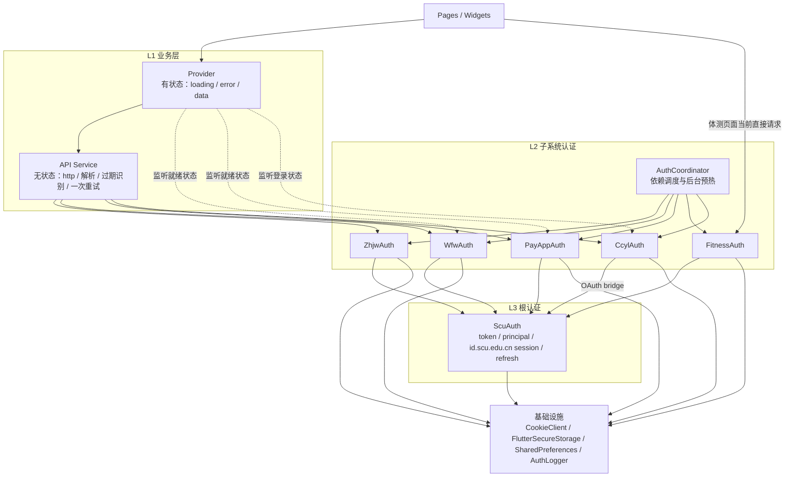
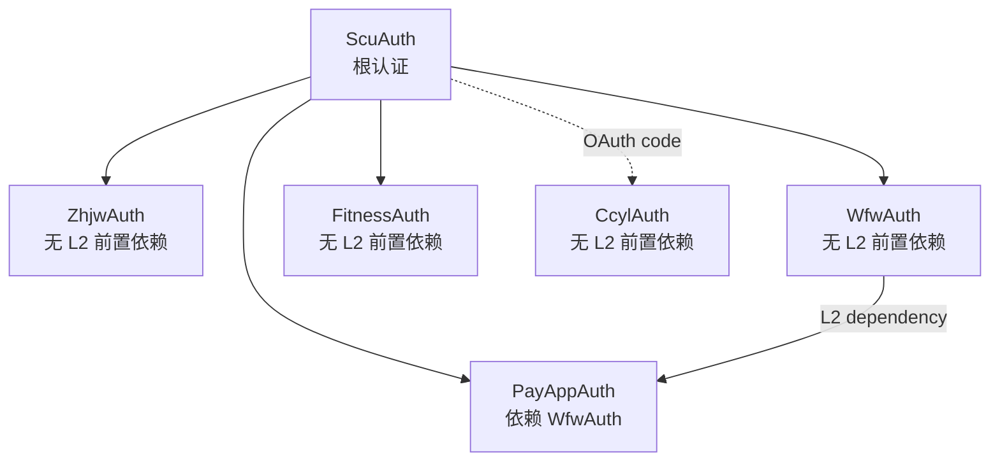
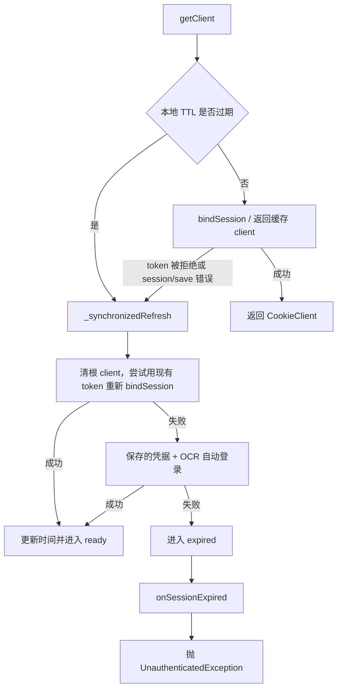
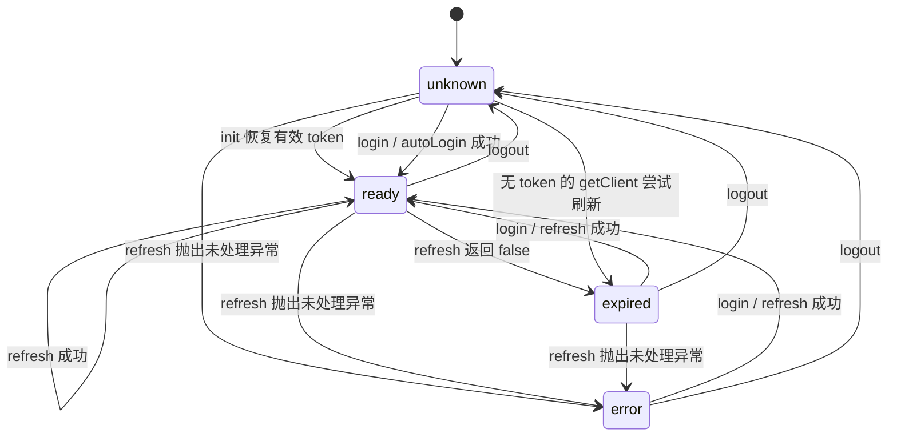
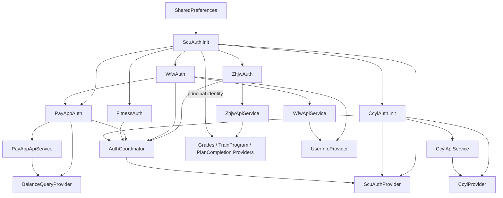

# 认证架构

> 文档状态：当前实现的权威说明
>
> 最后核对：2026-07-31
>
> 关键决策见 [ADR-0002：拆分子系统认证并显式声明依赖](../decisions/0002-separate-subsystem-authentication.md)。若本文与代码不一致，以代码为准，并应在同一变更中更新本文。

## 1. 范围与目标

本文描述 Bugaoshan 中需要 SCU 登录态的功能如何完成认证、子系统会话建立、业务请求、过期恢复和 UI 状态更新。覆盖以下后端：

| 后端 | 认证入口 | 主要功能 |
| --- | --- | --- |
| SCU 统一身份认证 | `id.scu.edu.cn` | 根 token、统一认证 session |
| 教务系统 | `zhjw.scu.edu.cn` | 课表、成绩、教室、培养方案、考表 |
| 微服务 | `wfw.scu.edu.cn` | 用户信息、校园服务标签 |
| 缴费平台 | `payapp.scu.edu.cn` | 电费、空调余额 |
| 体测系统 | `pead.scu.edu.cn` | 体测成绩和通知 |
| 第二课堂 | `dekt.scu.edu.cn` | 活动、报名、学分、用户信息 |

设计目标：

1. 根认证与子系统认证职责分离。
2. 无依赖子系统并发预热，单个后端故障不阻塞登录和其他功能。
3. 子系统会话按需自愈，每个认证恢复边界最多自动重放一次。
4. 并发请求共享同一次根刷新或子系统登录，避免认证风暴。
5. 切换账号或退出登录后，旧异步任务不能恢复旧会话或写回敏感数据。
6. Provider 只管理 UI 状态，API Service 不持有认证状态。

### 1.1 历史背景

2026-06-06 的提交 `7ded388` 将子系统认证从 `ScuAuth` 拆分到各自的 `SubsystemAuth`，并引入显式依赖调度。直接动因是无依赖后端不应相互阻塞：例如夜间校外教务不可用或超时时，WFW 仍应独立完成认证；PayApp 对 WFW 的真实依赖则显式保留。

## 2. 总体分层

认证相关代码采用三层架构。`CookieClient`、安全存储和日志属于各层共享的基础设施，不单独算业务层级。



### 2.1 各层职责

| 层 | 组件 | 状态 | 职责 |
| --- | --- | --- | --- |
| L1 | Provider | 有状态 | 管理 UI 数据、加载和错误状态；在需要时监听 L2 就绪状态 |
| L1 | API Service | 无认证状态 | 执行业务 HTTP、解析响应、识别会话过期、调用对应 L2 Auth 并有限重试 |
| L2 | `SubsystemAuth` 实现 | 有状态 | 建立和缓存本子系统 session/token，声明真实的 L2 前置依赖 |
| L2 | `AuthCoordinator` | 单轮任务状态 | 并发预热 L2 模块、等待各自依赖、隔离失败、检测依赖环 |
| L3 | `ScuAuth` | 有状态 | SCU 密码登录、根 token、当前账号、统一认证 session、TTL 与自动续期 |

依赖方向固定为：

```text
UI -> Provider -> API Service -> SubsystemAuth -> ScuAuth
                       |               |
                       +----------> shared infrastructure
```

`ScuAuthProvider` 是例外：它是认证 UI 的控制器，因此直接调用 `ScuAuth`、`CcylAuth` 和 `AuthCoordinator`。

## 3. 子系统依赖图

[`SubsystemAuth`](https://github.com/The-Brotherhood-of-SCU/Bugaoshan/blob/main/lib/services/auth/subsystem_auth.dart) 的契约为：

```dart
abstract interface class SubsystemAuth {
  String get moduleId;
  List<SubsystemAuth> get dependencies;
  Future<void> ensureAuthenticated();
  void invalidate();
}
```

当前依赖关系：



这里的"无依赖"仅表示没有其他 **L2 子系统**作为前置条件。所有模块最终仍需要根认证；`CcylAuth` 还通过 SCU OAuth 获取 code。

| 模块 | L2 依赖 | 会话形式 | 关键行为 |
| --- | --- | --- | --- |
| `ZhjwAuth` | 无 | 共享 `CookieClient` 中的教务 cookie | 携带 SCU Bearer token 执行 JWT SSO；校验最终 HTTP 状态 |
| `WfwAuth` | 无 | 共享 `CookieClient` 中的 WFW cookie | 跟随 WFW 登录重定向链完成 SSO 预热并校验最终业务响应，通过后才把 `isReady` 设为 `true` |
| `FitnessAuth` | 无 | 共享 `CookieClient` 中的体测 cookie | 通过 `SsoRelayAuth` 完成 SSO 跳转 |
| `PayAppAuth` | `WfwAuth` | 共享 `CookieClient` 中的 `airWarrant` 等 cookie | WFW 就绪后通过 `SsoRelayAuth` 完成缴费平台 SSO |
| `CcylAuth` | 无 | 独立 OAuth token | token 与当前 SCU principal 绑定，不共享 cookie session |

### 3.1 为什么 PayApp 依赖 WFW

缴费平台的认证链需要先完成微服务认证，因此 `PayAppAuth` 构造时显式接收 `WfwAuth`，并把它放入 `dependencies`。这是业务依赖，不用模块注册顺序隐式表达。

### 3.2 为什么 WFW 有独立的 ready 状态

恢复 SCU token 或完成 `session/save` 只说明 `id.scu.edu.cn` session 可用，不代表 `wfw.scu.edu.cn` 已建立 session。WFW API 常带 `X-Requested-With`，未预热时服务端可能直接返回"用户信息已失效"，不会自动进入 SSO 重定向。

WFW 首页也不能用来预热：它匿名访问直接返回 200 并下发匿名 `eai-sess` cookie，永远不触发 SSO 链。因此 [`WfwAuth`](https://github.com/The-Brotherhood-of-SCU/Bugaoshan/blob/main/lib/services/auth/wfw_auth.dart) 必须：

1. 获取当前 `ScuAuth` 的 `CookieClient`。
2. 不带 AJAX header 访问需登录的 `uc/wap/user/get-info` 并手动跟随重定向：匿名时链路为 get-info → `uc/wap/login` → `a_scu/api/cas/login` → `id.scu.edu.cn` CAS → 回跳 wfw 绑定用户 session。
3. 仅在最终响应为 `e == 0` 的 JSON 时才设置 `_ready = true`（链路落在 `id.scu.edu.cn/login` HTML 或返回 `e == 10013` 都视为未绑定，排除匿名 session 误报）。
4. 通过 `notifyListeners()` 触发 `UserInfoProvider` 获取数据。

## 4. AuthCoordinator 调度

[`AuthCoordinator`](https://github.com/The-Brotherhood-of-SCU/Bugaoshan/blob/main/lib/services/auth/auth_coordinator.dart) 在统一认证成功后进行尽力而为的后台预热：

```text
zhjw + wfw + fitness + ccyl   concurrently
         |
         +-> payapp           waits only for wfw
```

实际实现不是预先生成拓扑层，而是立即为所有顶级模块创建任务；每个任务递归等待自己的 `dependencies`。同一轮中，每个模块的 Future 会被缓存，因此被多个下游依赖时仍只执行一次。

调度规则：

1. `warmUpAll()` 自身是 single-flight；同一轮并发调用共享 `_warmUpFuture`。
2. 某模块失败时记录日志并返回失败结果，不向 `warmUpAll()` 调用方抛出。
3. 只有依赖该模块的下游会跳过，其他分支继续运行。
4. 递归路径中发现同一模块时视为依赖环，该分支失败并记录日志。
5. `invalidateAll()` 清除预热 Future，并调用每个模块的 `invalidate()`。

预热入口有两个：

- [`ScuAuthProvider.login()`](https://github.com/The-Brotherhood-of-SCU/Bugaoshan/blob/main/lib/providers/scu_auth_provider.dart)：用户登录成功后通过 `unawaited` 启动，登录页不等待慢模块。
- [`HomePage._attemptAutoLogin()`](https://github.com/The-Brotherhood-of-SCU/Bugaoshan/blob/main/lib/pages/home_page.dart)：冷启动恢复到有效根登录态时启动。

预热不是可用性的唯一入口。用户直接进入某功能时，API Service 或页面仍会调用对应 Auth 的 `getClient()` / `ensureAuthenticated()` 按需认证。因此一次预热失败不会让模块永久停留在不可用状态。

## 5. 根认证 ScuAuth

[`ScuAuth`](https://github.com/The-Brotherhood-of-SCU/Bugaoshan/blob/main/lib/services/auth/scu_auth.dart) 是根认证的单一事实来源，负责：

- 获取验证码和 SM2 公钥，以 SM2 加密密码后登录。
- 将 access token 存入 `FlutterSecureStorage`。
- 记录当前 SCU principal，并通过 token fingerprint 校验持久化绑定。
- 用 Bearer token 调用 `session/save`，建立 `id.scu.edu.cn` cookie session。
- 缓存一个可复用、按域隔离 cookie 的 `CookieClient`。
- 按本地 1 小时 TTL 检测过期并自动续期。
- 对并发 `bindSession` 和并发 refresh 做 single-flight。
- 自动续期最终失败时通知全局 UI。

`ScuAuth` 不负责 ZHJW、WFW、PayApp、Fitness 或 CCYL 的具体 SSO/token 换取。

### 5.1 初始化和登录

应用启动时 `ScuAuth.init()` 从安全存储恢复 token 与 principal binding，从 `SharedPreferences` 恢复登录时间：

- token 存在且本地 TTL 未过期：进入 `ready`。
- token 缺失：保持 `unknown`。
- token 存在但 TTL 已过期：暂不宣告可用，首次 `getClient()` 时尝试刷新。

密码登录成功后会同时提交 token、principal、token fingerprint 和登录时间，再进入 `ready`。

### 5.2 bindSession

`bindSession()` 调用统一认证的 `session/save`：

```text
access token
  -> POST id.scu.edu.cn/.../session/save
  -> collect Set-Cookie into CookieClient
  -> mark CookieClient reusable
  -> cache and return client
```

并发调用共享 `_bindSessionFuture`。以下响应不会被缓存为成功：

- HTTP 401/403：抛 `UnauthenticatedException`。
- JSON `error == invalid_token`：抛 `UnauthenticatedException`。
- 其他非 2xx 或 `success != true`：抛 `ServiceException`。

### 5.3 getClient 与自动续期

`getClient()` 的恢复顺序：



`_synchronizedRefresh()` 用一个 `Completer<bool>` 合并并发刷新：N 个同时发现过期的请求只执行一次 `_doRefresh()`，其余调用等待同一结果。

自动登录存在两个入口，重试策略不同：

- `ScuAuth.autoLogin()`：刷新内部使用，执行一次验证码 OCR 登录。
- `ScuAuthProvider.autoLogin()`：冷启动 UI 使用，服务端返回 `invalid_captcha` 时最多尝试 5 次。

### 5.4 状态机

`AuthState` 描述根认证状态，而不是每个子系统的完整状态：



TTL 到期本身不会先把状态切换为 `expired`。系统会直接尝试刷新；只有刷新最终返回失败才进入 `expired`。

## 6. 会话一致性与并发安全

### 6.1 根 CookieClient 身份

`ScuAuth` 刷新、重新绑定或重新登录后可能返回新的 `CookieClient`。L2 的 cookie 型模块在下一次 `getClient()` 时用对象身份判断根 client 是否变化：

- `ZhjwAuth`：清除教务 client 缓存和登录 Future，重新执行 JWT SSO。
- `WfwAuth`：清除 `_ready` 和预热 Future，重新走 WFW 登录链预热。
- `SsoRelayAuth`：清除子站 client 和登录 Future，重新执行中继。

这条规则避免把旧根 session 上建立的子系统 cookie 错当成新会话的一部分。

当前 `SsoRelayAuth.isReady` 在根认证离开 ready 或显式 `invalidate()` 时复位；仅观察到根 client 对象变化时不会先复位。因此它是 UI 预热提示，不是业务请求的授权依据。PayApp 和 Fitness 的每次请求仍必须调用 `getClient()`，由 client identity 检查保证重新中继。

### 6.2 子系统 single-flight

根层和子系统层分别合并并发任务：

| 场景 | 合并字段 |
| --- | --- |
| 根 session 绑定 | `ScuAuth._bindSessionFuture` |
| 根 token 刷新 | `ScuAuth._refreshCompleter` |
| 一轮子系统预热 | `AuthCoordinator._warmUpFuture` |
| 教务 SSO | `ZhjwAuth._loginFuture` |
| WFW 登录链预热 | `WfwAuth._warmUpFuture` |
| PayApp / Fitness SSO | `SsoRelayAuth._loginFuture` |
| CCYL 自动重登录与过期恢复 | `CcylAuth._reLoginFuture` |

### 6.3 登出期间的旧任务

`ScuAuth.logout()` 递增 `_authEpoch`，使正在执行的 refresh 在完成时放弃写回；同时完成正在等待的刷新 `Completer`，避免调用方永久挂起。旧 `CookieClient` 使用 `closeForce()` 关闭，即使它此前被标记为 reusable。

`CcylAuth` 使用独立的 `_authGeneration`。开始新的手动登录、过期恢复或退出时 generation 会变化；SCU 账号变化则由 principal 比较单独识别。旧 OAuth 请求只有 generation 和 principal 都仍匹配时才能提交 token。

## 7. 业务请求与恢复策略

认证恢复分为三条路径，不能混用。

### 7.1 ZHJW / WFW / PayApp

这三个 API Service 使用 [`retryOnUnauthenticated`](https://github.com/The-Brotherhood-of-SCU/Bugaoshan/blob/main/lib/services/api/api_request.dart)：

```text
getClient -> business request
  -> UnauthenticatedException
  -> invalidate current L2 auth
  -> getClient again
  -> replay business request once
  -> second failure propagates to Provider
```

`invalidate()` 只清当前模块的缓存，不清理无关模块。普通网络错误、解析错误、限流和业务错误不会触发此重试。

各 API Service 必须把该后端的"登录页、空响应、业务过期码"等明确识别为 `UnauthenticatedException`；不能把任意 HTML 或普通业务失败当成认证过期，否则可能错误重放写请求。

### 7.2 CCYL

CCYL 通过业务响应码表示 token 过期，因此使用 [`retryOnCcylAuthError`](https://github.com/The-Brotherhood-of-SCU/Bugaoshan/blob/main/lib/services/api/ccyl_api_service.dart)，不使用通用 wrapper：

```text
ensureAuthenticated
  -> business request
  -> CcylAuthExpiredException only
  -> recoverExpiredSession (single-flight)
  -> replay once
```

普通 `CcylException`、网络异常和解析异常直接上抛。这个边界用于防止报名、取消、导出等非幂等操作因普通业务错误被重复提交。

### 7.3 Fitness

体测目前没有独立 API Service，HTTP 和恢复逻辑仍位于 [`fitness_test_page.dart`](https://github.com/The-Brotherhood-of-SCU/Bugaoshan/blob/main/lib/pages/campus/fitness_test/fitness_test_page.dart)：

- `FitnessAuth.getClient()` 按需建立 SSO。
- `UnauthenticatedException` 会重试请求一次。
- 体测业务响应明确表示 session 过期时，先 `FitnessAuth.invalidate()`，再重试一次。

这是当前实现的例外，不应据此把新的后端 HTTP 逻辑继续放入页面。后续若体测 API 扩大，应提取无状态 `FitnessApiService` 并统一恢复边界。

### 7.4 HTTP ClientException

[`CookieClient`](https://github.com/The-Brotherhood-of-SCU/Bugaoshan/blob/main/lib/services/auth/cookie_client.dart) 在底层 `http.Client` 抛 `ClientException` 时会重建 client 并重发一次。这是传输层恢复，与认证重试相互独立。第二次失败直接上抛。

## 8. CCYL 的账号隔离

CCYL 拥有独立 token，但该 token 是通过当前 SCU 账号授权得到的，不能跨账号恢复。

持久化的 CCYL session 包含：

```text
token + userId + scuPrincipal
```

安全约束：

1. `ScuAuth` 的 principal 与 access token fingerprint 一起存储；token 变化但绑定不匹配时，不恢复 principal。
2. `CcylAuth.init()` 只在持久化 principal 等于当前 `ScuAuth.principal` 时恢复 token。
3. `token`、`currentUser` 和 `isLoggedIn` getter 也实时检查 principal 绑定。
4. 发现旧 token 属于其他账号时，先清理内存和安全存储，再重新 OAuth。
5. 安全存储写入通过 `_storageTail` 串行化，避免旧清理操作晚于新登录而删除新 token。
6. `recoverExpiredSession()` 先使当前认证 generation 失效，再清 token，并让所有并发过期请求共享一次重新登录。

`CcylAuth` 不监听并简单转发 `ScuAuth.notifyListeners()`；账号一致性由 principal binding、按需校验和 `ScuAuthProvider.logout()` 的显式清理共同保证。

## 9. CookieClient 与重定向安全

`CookieClient` 是 cookie 型认证的共享传输层：

- cookie 按响应 host 存储。
- 请求只携带当前 host 或其父域对应的 cookie。
- SSO 使用手动重定向，每一跳收集 `Set-Cookie`。
- 默认只在同源跳转中继续发送 `Authorization`、`Proxy-Authorization` 和显式 `Cookie` header。
- 跨源转发敏感 header 必须通过 `sensitiveHeaderAllowedOrigins` 明确允许。
- 重定向最多 10 跳，缺失或非法 Location、超过上限均作为服务错误处理。
- `close()` 不会关闭标记为 reusable 的根 client；登出和替换必须调用 `closeForce()`。

新的 SSO 流程必须复用这些能力，不能自行拼接全域 cookie 或无条件把 Bearer token 转发到重定向目标。

## 10. 通知链与 UI 集成

系统同时使用响应式和按需式两种模式。

### 10.1 响应式模式

适合认证完成后应自动加载的数据：

```text
ScuAuth login / restore
  -> AuthCoordinator.warmUpAll
  -> WfwAuth warm-up succeeds
  -> WfwAuth.isReady = true + notifyListeners
  -> UserInfoProvider schedules fetch
  -> WfwApiService fetches profile + labels
  -> Provider updates UI state
```

`UserInfoProvider` 用 request generation 丢弃退出登录或新一轮请求之前产生的旧结果，并串行持久化用户信息。

`PayAppAuth`、`FitnessAuth` 也暴露 `isReady`，供现有页面或 Provider 感知 SSO 完成。`ZhjwAuth` 目前没有独立 ready 属性，教务功能主要由用户操作触发并在请求时认证。

### 10.2 按需模式

成绩、培养方案、教室等功能由用户操作触发：

```text
Page
  -> Provider.refresh/load
  -> ZhjwApiService
  -> ZhjwAuth.getClient
  -> ScuAuth.getClient
  -> business request
```

Provider 捕获最终异常并转换为页面状态，不实现 token、cookie 或 SSO 细节。

### 10.3 全局过期提示

根刷新最终失败时，`ScuAuth.getClient()` 调用 `onSessionExpired`。[`SessionExpiredListener`](https://github.com/The-Brotherhood-of-SCU/Bugaoshan/blob/main/lib/widgets/common/session_expired_listener.dart) 显示带"前往登录"操作的 SnackBar，并使用 5 秒冷却避免并发请求重复提示。

## 11. 异常边界

根认证异常定义在 [`scu_exceptions.dart`](https://github.com/The-Brotherhood-of-SCU/Bugaoshan/blob/main/lib/services/auth/scu_exceptions.dart)，CCYL 业务异常定义在 [`ccyl_service.dart`](https://github.com/The-Brotherhood-of-SCU/Bugaoshan/blob/main/lib/services/ccyl/ccyl_service.dart)：

| 异常 | 含义 | 自动重试 |
| --- | --- | --- |
| `UnauthenticatedException` | 根或子系统认证失效 | 指定 API wrapper 中最多一次 |
| `ServiceException` | HTTP、响应格式或服务端业务错误 | 不因认证机制自动重试 |
| `RateLimitedException` | 明确的服务端限流 | 不自动重试 |
| `ScuLoginException` | 验证码、账号密码或登录接口错误 | 仅 UI 自动登录对 `invalid_captcha` 有限重试 |
| `CcylAuthExpiredException` | CCYL 明确返回 token 过期 | CCYL wrapper 中最多一次 |
| 普通 `CcylException` | CCYL 业务失败 | 不自动重试 |

`ScuAuth.getClient()` 对 `bindSession()` 产生的 `ServiceException` 有一条根层自愈路径：清根 client 后尝试 refresh。这不代表 L1 API Service 可以把普通 `ServiceException` 当作认证失败重放。

异常传播方向：

```text
L3 ScuAuth
  -> L2 SubsystemAuth
  -> L1 API Service recovery boundary
  -> Provider / Page error state
```

## 12. 持久化与敏感数据

| 数据 | 存储 | 说明 |
| --- | --- | --- |
| SCU access token | `FlutterSecureStorage` | 敏感凭据 |
| SCU principal binding | `FlutterSecureStorage` | principal + token fingerprint |
| 保存的账号密码 | `FlutterSecureStorage` | 仅自动登录使用 |
| 自动登录开关 | `FlutterSecureStorage` | 与凭据策略一起管理 |
| CCYL session | `FlutterSecureStorage` | token + userId + SCU principal |
| SCU 登录时间 | `SharedPreferences` | 本地 TTL 判断，不是凭据 |
| 用户姓名、学号缓存 | `SharedPreferences` | 退出登录时清理 |

安全规则：

- token、密码和 OAuth 凭据不得迁移到 `SharedPreferences`。
- 日志不得记录 access token、密码、完整 OAuth code 或敏感 URL 参数。
- 账号相关缓存必须绑定已确认的 principal，不能仅以"当前处于登录态"作为身份依据。
- 退出登录必须使飞行中的认证和持久化任务失效。

### 12.1 认证日志

[`AuthLogger`](https://github.com/The-Brotherhood-of-SCU/Bugaoshan/blob/main/lib/utils/auth_logger.dart) 是 GetIt 注册的全局单例。认证模块使用类名作为 tag，把关键状态变化写入默认 1000 条的内存环形缓冲：

- 每条消息先经过 `AuthLogRedactor`，再进入内存、控制台或文件。
- redactor 处理 token、密码、Bearer header、OAuth code 和用户标识。
- 仅 debug 构建同步输出控制台日志。
- 文件 sink 默认关闭；开发者页面可查看、过滤、清空和导出脱敏日志。

新增认证日志时仍应避免主动拼入敏感值。脱敏器是最后一道保护，不是记录凭据的许可。

## 13. 依赖注入与生命周期

认证组件在 [`injector.dart`](https://github.com/The-Brotherhood-of-SCU/Bugaoshan/blob/main/lib/injection/injector.dart) 中手动注册，顺序为：



退出登录由 `ScuAuthProvider.logout()` 统一编排：

1. `ScuAuth.logout()` 清根 token、principal、时间和 client，并使根刷新失效。
2. `CcylAuth.logout()` 清独立 token 和用户。
3. `AuthCoordinator.invalidateAll()` 清所有 L2 缓存。
4. 清用户姓名、学号等本地 UI 缓存。
5. `injector.dart` 注册的根状态 listener 进一步清理 `PlanCompletionProvider`、`UserInfoProvider` 等下游缓存。

## 14. 文件结构

```text
lib/
├── providers/
│   ├── scu_auth_provider.dart       # 登录 UI 控制器、预热和登出编排
│   ├── user_info_provider.dart      # 监听 WfwAuth，自动加载用户信息
│   ├── grades_provider.dart         # 教务业务状态和按账号缓存
│   ├── train_program_provider.dart
│   ├── plan_completion_provider.dart
│   ├── balance_query_provider.dart
│   └── ccyl_provider.dart
├── services/
│   ├── api/
│   │   ├── api_request.dart         # 通用认证失败重试一次
│   │   ├── zhjw_api_service.dart
│   │   ├── wfw_api_service.dart
│   │   ├── payapp_api_service.dart
│   │   ├── balance_query_service.dart
│   │   └── ccyl_api_service.dart    # CCYL 精确过期恢复
│   ├── auth/
│   │   ├── auth_state.dart
│   │   ├── scu_exceptions.dart
│   │   ├── cookie_client.dart
│   │   ├── scu_auth.dart            # L3 根认证
│   │   ├── subsystem_auth.dart      # L2 契约
│   │   ├── auth_coordinator.dart    # L2 调度
│   │   ├── zhjw_auth.dart
│   │   ├── wfw_auth.dart
│   │   ├── sso_relay_auth.dart
│   │   ├── payapp_auth.dart
│   │   ├── fitness_auth.dart
│   │   ├── ccyl_auth.dart
│   │   └── ccyl_oauth_service.dart
│   └── ccyl/
│       └── ccyl_service.dart        # CCYL 底层 HTTP 与业务错误分类
├── utils/
│   ├── auth_logger.dart             # 脱敏认证日志
│   └── secure_storage.dart
└── widgets/common/
    └── session_expired_listener.dart
```

## 15. 新增子系统规范

新增需要 SCU 登录的后端时：

1. 实现 `SubsystemAuth`，使用稳定且唯一的 `moduleId`。
2. `dependencies` 只声明真实 L2 依赖；依赖 SCU 根认证不需要放入该列表。
3. 在 `ensureAuthenticated()` 内完成本模块 SSO 或 token 换取，并校验最终响应确实成功。
4. 合并并发登录，避免多个页面请求同时发起重复 SSO。
5. cookie 型模块必须在根 `CookieClient` 身份变化时清理缓存。
6. `invalidate()` 必须清理 client/token、ready 状态和正在缓存的登录 Future；若有异步写回，还必须使旧任务失效。
7. 新建无状态 API Service，在其中识别该后端明确的认证过期信号。
8. 只在明确认证过期时重试一次；普通业务错误不得重放非幂等请求。
9. 在 `injector.dart` 注册 Auth、API Service 和 Provider，并把 Auth 加入 `AuthCoordinator`。
10. 为并发合并、会话过期、账号切换、登出竞态和重试上限增加针对性测试。

## 16. 不变量

修改认证代码时必须保持：

1. `ScuAuth` 是根 token、principal 和统一认证 session 的单一事实来源。
2. L2 模块之间只通过显式 `dependencies` 建立依赖。
3. 一个 L2 模块失败不能阻塞无关模块。
4. 预热失败后，功能入口仍可按需重新认证。
5. 同一认证操作的并发调用必须合并。
6. 新根 client 不能复用旧根 client 上的子系统 session cache；业务请求不能只信任 `isReady`，必须调用 `getClient()`。
7. 退出登录或切换账号后，旧异步结果不得恢复会话或覆盖新账号数据。
8. 自动重试必须有限，并且只针对明确的认证失效。
9. 敏感凭据只进入安全存储，日志在写入前完成脱敏。
10. Provider 不实现 token、cookie、SSO 或 OAuth 细节。

## 17. 现有测试覆盖

认证相关的重点回归测试位于：

| 测试 | 覆盖内容 |
| --- | --- |
| `test/scu_auth_test.dart` | 401/403、`invalid_token`、并发根刷新 single-flight |
| `test/wfw_auth_test.dart` | 根 client 变化后重新预热、WFW 业务过期码后恢复一次 |
| `test/payapp_session_expiry_test.dart` | PayApp 登录页识别、一次重试上限、普通 HTML 不误判 |
| `test/ccyl_api_retry_test.dart` | 仅明确 CCYL 过期码触发重放 |
| `test/ccyl_auth_principal_test.dart` | CCYL token 不跨 SCU 账号恢复 |
| `test/ccyl_auth_generation_test.dart` | 旧 OAuth 结果在退出或切换后不得写回 |
| `test/user_info_provider_test.dart` | 用户信息请求 generation 与持久化竞态 |
| `test/grades_provider_test.dart` | 教务缓存要求经过 token binding 确认的 principal |

当前没有独立的 `AuthCoordinator` 依赖环/失败隔离单元测试，也没有 ZHJW 和通用 `SsoRelayAuth` 的直接单元测试。修改调度或 SSO 基类时，应优先补齐这些缺口。
