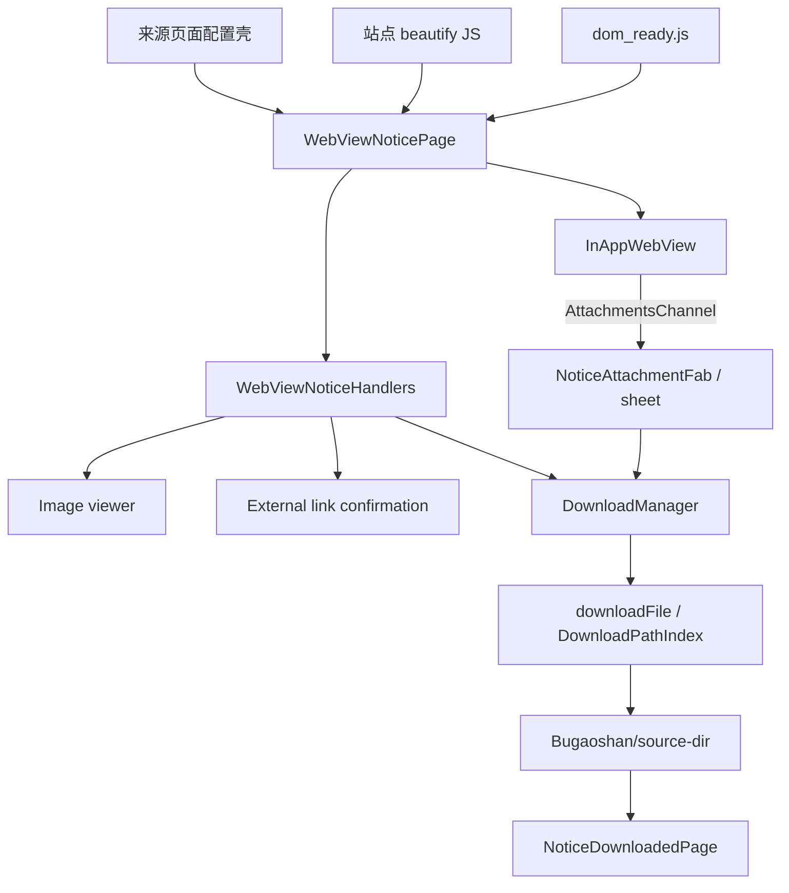

# 通知 WebView 架构

> 文档状态：当前实现的权威说明
>
> 最后核对：2026-07-31
>
> 设计取舍见 [ADR-0001：通知页面采用 WebView 和站点 JS 适配](../decisions/0001-use-webview-and-js-injection-for-notices.md)。若本文与代码不一致，以代码为准，并应在同一变更中更新本文。

## 1. 范围

本文描述教务处、党委学工部和团委三类校园通知页面的 WebView、JavaScript bridge 和附件下载链路。共享组件也被志愿四川页面复用，但志愿四川不是通知下载体系的一部分。

核心原则：

1. 来源页面只提供配置，不复制 WebView 生命周期。
2. 站点 DOM 适配留在来源专用 JavaScript 中。
3. 导航、错误页、外链、图片和 bridge 由共享 Flutter 组件处理。
4. 下载状态和文件落盘由 Dart 管理，不依赖 WebView 自身保存文件。
5. 来源下载模式和额外 header 通过 `DownloadOptions` 传入，WebView cookie 在具体下载时按目标 URL 获取。

## 2. 来源配置

| 来源 | URL | 适配脚本 | 附件目录 | 标签 | 下载方式 |
| --- | --- | --- | --- | --- | --- |
| 教务处 JWC | `https://jwc.scu.edu.cn/tzgg.htm` | `assets/js/jwc_notice_beautify.js` | `notice_attachments` | 0 | Dart HTTP |
| 党委学工部 XGB | `https://xgb.scu.edu.cn/index/tzgg.htm` | `assets/js/party_notice_beautify.js` | `party_attachments` | 1 | Dart HTTP |
| 团委 Tuanwei | `https://tuanwei.scu.edu.cn/index/gg.htm` | `assets/js/tuanwei_notice_beautify.js` | `tuanwei_attachments` | 2 | 面板下载先由 WebView 触发；Dart 落盘；附带团委 Referer |

对应配置壳位于：

- `lib/pages/campus/notice/jwc/campus_notice_page.dart`
- `lib/pages/campus/notice/xgb/party_notice_page.dart`
- `lib/pages/campus/notice/tuanwei/tuanwei_notice_page.dart`

志愿四川使用同一个 `WebViewNoticePage` 和 `assets/js/volunteer_sichuan.js`，关闭 loading mask，且不传 `DownloadOptions`。

## 3. 组件边界



### 3.1 `WebViewNoticePage`

共享页面负责：

- 创建和销毁 `InAppWebViewController`。
- 注册 JavaScript handlers。
- 加载来源 URL，处理前进、后退、关闭和外部浏览器打开。
- 在 `onLoadStop` 注入 beautify script 和 `dom_ready.js`。
- 显示 loading mask、错误 HTML 和附件悬浮按钮。
- HarmonyOS 显示不支持页面。

### 3.2 `WebViewNoticeHandlers`

处理器 mixin 负责 bridge 消息、WebView cookie 获取、外链确认、图片预览和三类下载入口。页面本身不解析附件 JSON 或直接操作 `DownloadManager`。

### 3.3 站点脚本

三份通知脚本分别负责：

- 隐藏页头、页脚、侧栏等不适合应用内展示的元素。
- 注入移动端和深色模式 CSS。
- 根据站点 DOM 重组列表或详情布局。
- 识别图片、外链和附件。
- 把附件文件名以 Base64 编码后发送给 Flutter，避免跨 bridge 的字符编码问题。

脚本仍强依赖官网 DOM。所谓"WebView 方案"只是把解析和适配从 Dart 转移到 JavaScript，不代表官网改版后无需维护。

## 4. 页面加载生命周期

```text
initState
  -> async load error HTML, beautify JS, dom_ready.js
  -> create WebView and register handlers
  -> onLoadStart: show mask, clear page attachments
  -> remote page loads
  -> onLoadStop
       -> evaluate beautify JS when available
       -> evaluate dom_ready.js when available
       -> DOMReady handler or fallback finishes loading
  -> refresh back/forward state
```

`dom_ready.js` 使用双重 `requestAnimationFrame`，用于等待同步 DOM 改写经过两帧布局后关闭 mask。它不保证图片、字体或远程异步内容已经全部完成。

主 frame 加载失败时，页面使用 `assets/webview_error.html` 展示错误。子资源错误只记录日志，不替换整个页面。

## 5. JavaScript bridge

| Handler | 方向 | 参数 | Flutter 行为 |
| --- | --- | --- | --- |
| `AttachmentsChannel` | JS -> Flutter | JSON 字符串；元素含 `url`、Base64 `name` | 解析附件并显示 FAB |
| `DOMReady` | JS -> Flutter | 无 | 结束 loading mask，刷新导航状态 |
| `DownloadAttachment` | JS -> Flutter | `url`, `name` | 合并 cookie/header，交给 `DownloadManager` |
| `OpenImage` | JS -> Flutter | 图片 URL | 打开全屏图片查看器 |
| `OpenExternalLink` | JS -> Flutter | 外链 URL | 显示确认对话框，通过系统浏览器打开 |

`DownloadAttachment` 仅在来源配置了 `DownloadOptions` 时注册。修改 handler 名称、参数顺序或编码时，必须同步 `webview_notice_handlers.dart` 和所有调用它的脚本。

## 6. 附件发现与交互

每个站点脚本根据自己的 DOM 和链接规则扫描附件，并发送完整附件列表。识别规则不只依赖某个固定 `download.jsp`，还可能结合 URL、扩展名、附件区域 class 和链接文本。

附件列表非空时，`NoticeAttachmentFab` 显示在 WebView 上方。点击后打开 `showAttachmentsSheet()`，每项根据 `DownloadManager` 和本地文件索引展示以下状态：

```text
not downloaded -> pending/downloading -> done
                              |
                              +-> error -> retry
```

已完成文件可以直接打开或分享。顶部文件夹入口打开 `NoticeDownloadedPage`，按 JWC、XGB、Tuanwei 三个目录管理文件。

## 7. 下载链路

当前有三种入口，但最终状态都汇入同一个 `DownloadManager`。

### 7.1 附件面板

JWC 和 XGB：

```text
sheet download
  -> DownloadManager.download
  -> Dart http.get
  -> write file and URL index
```

Tuanwei 配置 `useWebViewDownload: true`：

```text
sheet download
  -> enqueue task
  -> WebView.loadUrl(attachment URL)
  -> onDownloadStarting
  -> merge WebView cookie + configured Referer
  -> DownloadManager.download
```

### 7.2 页面内附件点击

脚本调用 `DownloadAttachment`。Flutter 从 WebView `CookieManager` 获取目标 URL 的 cookie，与来源 header 合并后下载；完成后重新打开附件面板展示状态。

### 7.3 原生下载事件

WebView 触发 `onDownloadStarting` 时，Flutter 使用 suggested filename、WebView cookie 和来源 header 创建下载任务。WebView 本身不负责最终落盘。

### 7.4 文件落盘

`downloadFile()` 执行以下步骤：

1. 使用 Dart `http.get` 获取字节。
2. 优先从 `Content-Disposition` 解析文件名。
3. 清理路径分隔符、控制字符和平台非法字符。
4. 文件重名时追加 `(n)`，不覆盖已有文件。
5. 写入平台下载基目录下的 `Bugaoshan/<source dir>/`。
6. 用 URL 的 SHA-256 建立独立索引项，支持同名附件和并发下载。

`DownloadManager` 是 GetIt 单例，因此任务状态可以跨页面导航保留；它不持久化任务状态，真实文件和 `DownloadPathIndex` 才是重启后的依据。

## 8. Cookie、Header 与信任边界

- WebView cookie 只在下载目标需要时读取并合并到该次下载 header。
- Tuanwei 显式配置 `Referer: https://tuanwei.scu.edu.cn`。
- 外链通过 `OpenExternalLink` 要求用户确认后交给系统浏览器。
- 站点脚本运行在远程页面上下文中，只应暴露完成具体 UI 命令所需的最小 handler。
- 新增来源时不得把登录 token、全量 cookie 或不相关域的敏感 header 注入页面。

当前共享页面没有 Dart 侧的导航 origin allowlist。来源脚本会拦截其识别的外链，但这不是完整的导航安全边界。

## 9. 平台边界

- Android、iOS、macOS、Windows 和 Linux 使用 `flutter_inappwebview` 对应后端。
- Linux 依赖 WPE WebKit 运行库；普通 Linux bundle 不私带 WPE，Flatpak 在 `/app` 前缀提供，详见 [Linux 分发架构](./linux-distribution.md)。
- HarmonyOS 当前直接显示 `WebViewUnsupportedPage`。
- WebView 后端行为可能影响下载回调、cookie 和窗口导航，新增平台必须验证完整通知与附件流程。

## 10. 已知技术债

1. beautify 和 `dom_ready.js` 通过 `rootBundle.loadString` 异步读取；如果首个 `onLoadStop` 早于脚本完成，当前实现不会在资源加载后补注入。
2. `downloadFile()` 默认添加 XGB Referer；没有显式配置的 JWC 下载也会携带该 header。默认值应下沉为来源配置。
3. 站点脚本依赖线上 DOM，目前没有自动化的真实站点 smoke test。
4. 共享页面没有完整的 origin allowlist，普通 WebView 导航仍需加强约束。
5. JS bridge 和下载流程缺少覆盖三个来源的端到端测试。

## 11. 新增通知来源

1. 新建只包含配置的来源页面，复用 `WebViewNoticePage`。
2. 新建站点专用 JS，不在共享 Dart 组件中加入来源选择器。
3. 配置独立附件目录、下载标签和必要的 Referer/cookie 策略。
4. 实现并验证移动端布局、深色模式、图片、外链和附件发现。
5. 验证列表、详情、前进后退、错误页、页面内下载、附件面板、重启后文件识别。
6. 在 Android、桌面目标和该来源依赖的其他平台上做实际 WebView smoke test。

## 12. 关键文件

```text
lib/widgets/webview/
├── webview_notice_page.dart
├── webview_notice_handlers.dart
├── download_options.dart
└── webview_unsupported_page.dart

lib/pages/campus/notice/
├── jwc/campus_notice_page.dart
├── xgb/party_notice_page.dart
└── tuanwei/tuanwei_notice_page.dart

lib/pages/campus/downloads/
├── attachment_fab.dart
├── attachments_sheet.dart
├── file_utils.dart
├── notice_downloaded_page.dart
└── shared_notice_downloads.dart

assets/js/
├── dom_ready.js
├── jwc_notice_beautify.js
├── party_notice_beautify.js
└── tuanwei_notice_beautify.js
```
