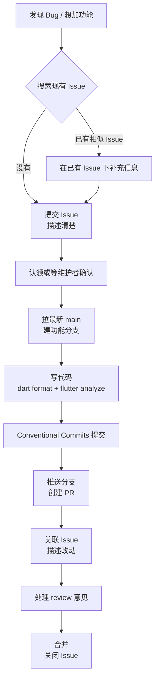

# 贡献规范

不高山上/Bugaoshan 遵循[约定式提交/Conventional Commit](https://www.conventionalcommits.org/zh-hans/)。

本文档面向初次参与 不高山上/Bugaoshan 的开发者，统一 Issue、Commit 与 Pull Request 的提交流程，让协作更顺畅、历史更清晰。

::: tip 快速定位

- 提交代码前请先阅读[贡献流程](./contribution.md)与[环境与构建](./getting-started.md)。
- 代码风格与架构约定以仓库根目录的 [AGENTS.md](https://github.com/The-Brotherhood-of-SCU/Bugaoshan/blob/main/AGENTS.md) 为准。
:::

## Issue 规范

### 提交 Issue 前

1. **先搜索**是否已有相同或相似的 Issue，避免重复。
2. 明确你的 Issue 类型：
   - **Bug 报告**：描述复现步骤、期望行为与实际行为、运行环境（平台 / 版本）。
   - **功能请求**：说明功能描述、使用场景，可参考 [Feature Request 模板](https://github.com/The-Brotherhood-of-SCU/Bugaoshan/blob/main/.github/ISSUE_TEMPLATE/feature_request.yml)。
3. 敏感信息（账号、token、个人数据）请打码，不要直接粘贴。

### 标题与标签

- 标题简洁地概括问题，例如 `[Bug] 课表导出到 ICS 后日期错位`。
- 按模板选择标签（如 `enhancement`、`bug`），方便维护者分类。

## Commit 规范

项目遵循[约定式提交/Conventional Commit](https://www.conventionalcommits.org/zh-hans/)，提交信息格式为：

```text
<type/类型>(<scope/作用域>): <subject/内容>
```

常用的 `type` 前缀：

| type | 含义 |
| --- | --- |
| `feat` | 新功能 |
| `fix` | 修复 Bug |
| `refactor` | 重构，不改功能 |
| `docs` | 文档变更 |
| `chore` | 构建、工具链等杂项 |
| `perf` | 性能优化 |
| `build` | 构建系统或外部依赖变更 |
| `ci` | CI 配置变更 |
| `test` | 测试相关 |
| `style` | 代码格式，不影响逻辑 |

示例：

```text
feat: 课表导出支持 ICS 日历
fix: 修复电费查询无限加载的问题
docs: 更新贡献规范文档
```

::: tip 为什么重要
发布脚本会按前缀自动归类生成更新日志（`feat` → Added、`fix` → Fixed 等），提交信息写得规范，更新日志才能准确。
:::

### 提交注意事项

- 一个提交只做一件事，不要把无关改动混在一起。
- `subject` 用祈使句、简短（一般不超过 50 字符）。
- 提交前先格式化代码。仓库内置 pre-commit hook，会对你暂存的 `.dart` 文件自动执行 `dart format`；请先按[环境与构建](./getting-started.md#pre-commit-hook)安装 hook。

## Pull Request 规范

### 创建 PR 前

1. 从最新 `main` 拉取，创建**功能分支**：

   ```bash
   git checkout main
   git pull origin main
   git checkout -b feature/your-feature
   ```

2. 分支命名建议：`feature/<功能>`、`fix/<问题>`、`docs/<内容>`。
3. 完成修改后，确保 `flutter analyze` 无新增告警，相关测试通过。

### PR 描述

- 说明**改了什么**、**为什么改**、**如何验证**。
- 关联相关 Issue：`Fixes #123` / `Closes #456`。
- 若包含截图或录屏，附上更直观。

### PR 注意事项

- **如果你正在使用AI，请确保你知道自己在干什么。**
- 保持 PR 聚焦：一个 PR 尽量只解决一个问题，便于 review。
- 若主分支有更新，用 `git rebase` 保持提交历史干净，而不是反复 merge（如果你不清楚rebase的操作，就不要sync)。
- 收到 review 意见后及时跟进；修改后更新你的分支。

## 提交流程一览


